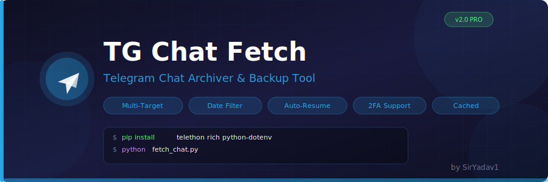
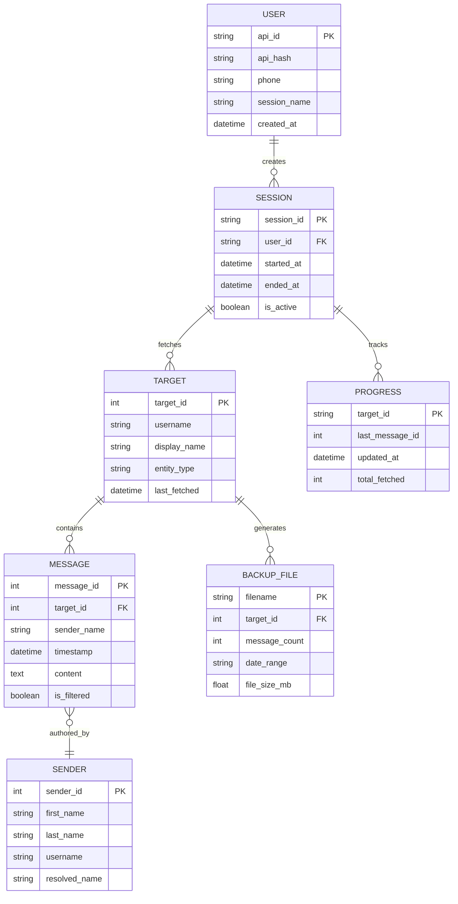

<p align="center">
  
</p>

<h3 align="center">A powerful Python tool for archiving Telegram conversations</h3>

<p align="center">
  
  
  
  
  
</p>

<p align="center">
  <a href="#-features">Features</a> •
  <a href="#-architecture">Architecture</a> •
  <a href="#-setup">Setup</a> •
  <a href="#-usage">Usage</a> •
  <a href="#-project-structure">Structure</a> •
  <a href="#-api-reference">API</a>
</p>

---

## Features

| Feature | Description |
|---------|-------------|
| **Multi-Target Backup** | Each target gets its own file (`Backup_Name_ID.txt`) |
| **Date Filtering** | Preset ranges (1/6/12 months) or custom start/end dates |
| **Auto-Resume** | Saves progress per target, resumes where you left off |
| **Entity Caching** | Resolves senders once, faster subsequent runs |
| **2FA Support** | Works with Two-Factor Authentication enabled accounts |
| **Credential Auto-Save** | Saves API credentials to `.env` for future runs |
| **Rich Terminal UI** | Beautiful console output with progress indicators |
| **Smart Date Swap** | Auto-corrects reversed date ranges |

---

## Architecture

### Entity Relationship Diagram



### Data Flow

```
┌─────────────┐    ┌──────────────┐    ┌─────────────┐
│  Telegram   │───▶│  Telethon    │───▶│  Processor  │
│  API Server │    │  Client      │    │  Pipeline   │
└─────────────┘    └──────────────┘    └──────┬──────┘
                                              │
                        ┌─────────────────────┼─────────────────────┐
                        │                     │                     │
                        ▼                     ▼                     ▼
                ┌──────────────┐      ┌──────────────┐      ┌──────────────┐
                │   Sender     │      │   Message    │      │   Progress   │
                │   Cache      │      │   Filter     │      │   Tracker    │
                └──────────────┘      └──────────────┘      └──────────────┘
                        │                     │                     │
                        └─────────────────────┼─────────────────────┘
                                              │
                                              ▼
                                    ┌──────────────────┐
                                    │   Backup File    │
                                    │   (.txt output)  │
                                    └──────────────────┘
```

---

## Setup

### Prerequisites

- Python 3.8 or higher
- Telegram API credentials from [my.telegram.org](https://my.telegram.org/auth)

### Installation

```bash
# Clone the repository
git clone https://github.com/SirYadav1/tg-chat-fetch.git
cd tg-chat-fetch

# Install dependencies
pip install -r requirements.txt
```

### Configuration

Create a `.env` file (or let the tool create one for you):

```env
API_ID=your_api_id
API_HASH=your_api_hash
PHONE=+91xxxxxxxxxx
```

---

## Usage

### Basic Usage

```bash
python fetch_chat.py
```

### Interactive Flow

```
┌─────────────────────────────────────────┐
│  1. Enter API Credentials               │
│  2. Login with OTP (+ 2FA if enabled)   │
│  3. Select Target (username/ID/phone)   │
│  4. Choose Date Range                   │
│  5. Fetch Messages → Save to File       │
└─────────────────────────────────────────┘
```

### Date Range Options

| Option | Range |
|--------|-------|
| `1` | Last 1 Month |
| `2` | Last 6 Months |
| `3` | Last 1 Year |
| `4` | Custom Range (YYYY-MM-DD) |
| `5` | All Messages |

### Output Format

```
[2026-06-24 14:30:22] [John Doe]: Hello, how are you?
[2026-06-24 14:31:05] [Jane Smith]: I'm doing great, thanks!
[2026-06-24 14:32:18] [John Doe]: Let's meet tomorrow.
```

---

## Project Structure

```
tg-chat-fetch/
├── fetch_chat.py          # Main script - Telegram client & fetcher
├── requirements.txt       # Python dependencies
├── .env.example           # Environment template
├── .env                   # Your credentials (gitignored)
├── .gitignore             # Git ignore rules
├── banner.svg             # Project banner
├── progress.json          # Auto-generated resume state
├── README.md              # Documentation
└── Backup_*.txt           # Generated chat archives
```

---

## API Reference

### Core Functions

| Function | Description |
|----------|-------------|
| `load_progress(target_id)` | Retrieves last saved message ID for resume |
| `save_progress(target_id, message_id)` | Saves current offset for later resume |
| `save_env_credentials(api_id, api_hash, phone)` | Saves credentials to `.env` |
| `setup_header()` | Displays application header |
| `get_date_limit()` | Prompts for date range filter |
| `main()` | Main async entry point |

---

## Dependencies

| Package | Purpose |
|---------|---------|
| `telethon` | Telegram MTProto API client |
| `rich` | Beautiful terminal formatting |
| `python-dotenv` | Environment variable management |

---

## Security

- Credentials are stored locally in `.env` (gitignored)
- Session files are created locally for re-use
- No data is sent to third-party servers
- All API calls go directly to Telegram's servers

---

## Contributing

Contributions are welcome! Please feel free to submit a Pull Request.

1. Fork the repository
2. Create your feature branch (`git checkout -b feature/amazing-feature`)
3. Commit your changes (`git commit -m 'Add amazing feature'`)
4. Push to the branch (`git push origin feature/amazing-feature`)
5. Open a Pull Request

---

## License

This project is licensed under the MIT License - see the [LICENSE](LICENSE) file for details.

---

## Acknowledgments

- [Telethon](https://github.com/LonamiWebs/Telethon) - Telegram client library
- [Rich](https://github.com/Textualize/rich) - Terminal formatting library
- [Python Telegram API](https://core.telegram.org/) - Official Telegram documentation

---

<p align="center">
  Made with ❤️ by <a href="https://github.com/SirYadav1">SirYadav1</a>
</p>
